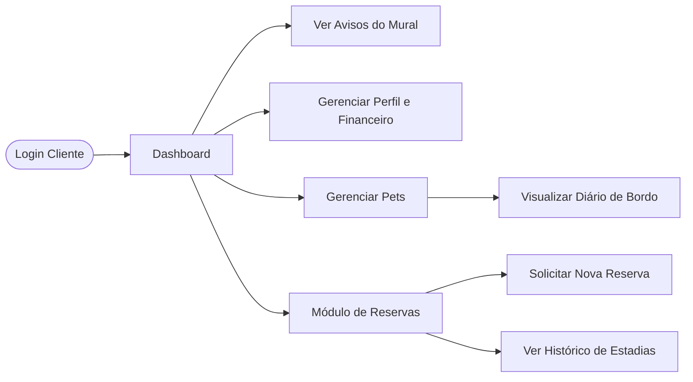
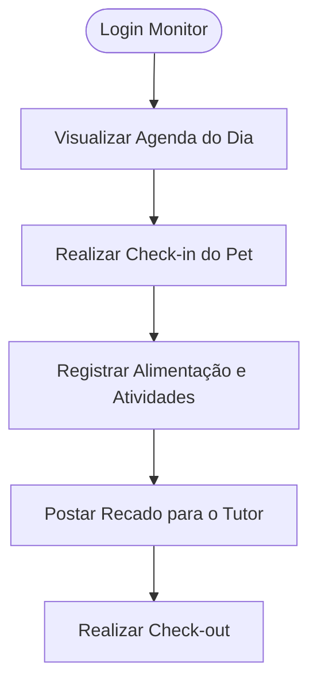
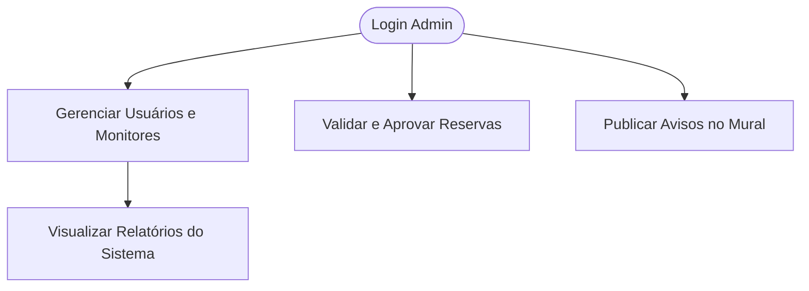
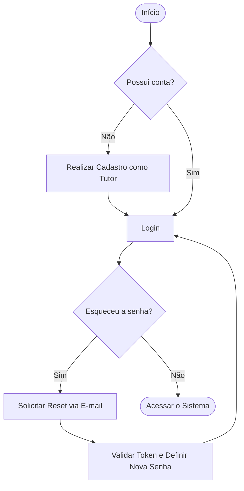
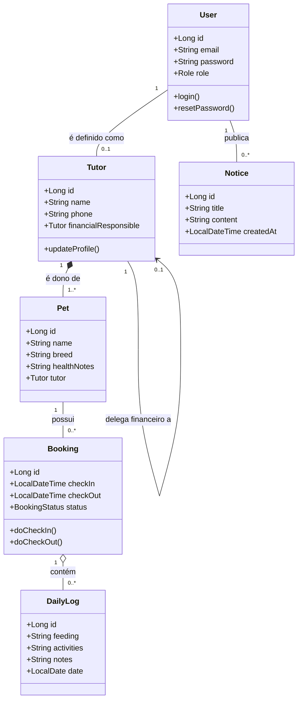

<div align="center">

# 🐾 PetStay API

### Backend para Gestão de Creche e Hotel Pet

*Projeto de portfólio desenvolvido com Java 21 + Spring Boot 3*


</div>

---

## Sobre o Projeto

O **PetStay** é o backend de uma solução completa para estabelecimentos de **Daycare e Hotelaria Pet**. O sistema gerencia tutores, pets, reservas, check-in/check-out e comunicação entre monitores e clientes.

O projeto foi concebido com foco em:
- **Boas práticas de Orientação a Objetos** (encapsulamento, composição e abstração)
- **Segurança robusta** com autenticação multi-perfil via JWT
- **Escalabilidade** com arquitetura desacoplada por camadas

> Este repositório contém exclusivamente o **backend (API REST)**. A interface de usuário está fora do escopo deste projeto.

---

## Sumário

1. [Tecnologias](#-tecnologias)
2. [Requisitos do Sistema](#-requisitos-do-sistema)
3. [Arquitetura e Princípios OO](#-arquitetura-e-princípios-oo)
4. [Perfis de Acesso e Jornadas](#-perfis-de-acesso-e-jornadas)
5. [Fluxo de Autenticação](#-fluxo-de-autenticação)
6. [Modelagem de Dados](#-modelagem-de-dados)
7. [Endpoints da API](#-endpoints-da-api)
8. [Como Executar](#-como-executar)

---

## Tecnologias

| Categoria | Tecnologia |
|---|---|
| Linguagem | Java 21 (LTS) |
| Framework | Spring Boot 3.x |
| Segurança | Spring Security + JWT |
| Banco de Dados | PostgreSQL 15 |
| ORM | Spring Data JPA / Hibernate |
| Documentação | Swagger (OpenAPI 3) |
| Build | Maven |
| Infraestrutura | Docker / Docker Compose |

---

##  Requisitos do Sistema

### Módulo de Acesso e Segurança

| Código | Requisito |
|---|---|
| RF01 | **Autenticação Multi-Perfil:** Login com distinção entre os perfis `ADMIN`, `MONITOR` e `CLIENTE` |
| RF02 | **Autocadastro:** Novos clientes podem se registrar diretamente como Tutores |
| RF03 | **Recuperação de Acesso:** Reset de senha com validação por token temporário |

### Módulo de Cadastros

| Código | Requisito |
|---|---|
| RF04 | **Gestão de Tutores:** Cadastro completo com dados pessoais, contato e endereço |
| RF05 | **Delegação Financeira:** O tutor pode ser o próprio responsável financeiro ou delegar a um terceiro |
| RF06 | **Gestão de Pets:** Vinculação de múltiplos pets a um tutor, com histórico e dados de saúde |

### Módulo Operacional

| Código | Requisito |
|---|---|
| RF07 | **Painel de Reservas:** Agendamento de estadias com controle de datas, horários e status |
| RF08 | **Fluxo de Estadia:** Check-in e check-out realizados pelo monitor |
| RF09 | **Diário de Bordo:** Registro individual de alimentação, atividades e recados por pet |
| RF10 | **Mural de Avisos:** Publicação de comunicados gerais pelo administrador |

---

## Arquitetura e Princípios OO

A aplicação segue uma **arquitetura em camadas** (Controller → Service → Repository) e aplica os pilares da Orientação a Objetos:

**Encapsulamento**
Entidades com atributos privados. Nenhum dado é exposto diretamente — toda comunicação externa ocorre via **DTOs**, protegendo a camada de domínio.

**Composição**
O objeto `DailyLog` (Diário de Bordo) só existe vinculado a um `Booking` (Reserva). Não há diário sem estadia ativa — a composição garante essa regra de negócio estruturalmente.

**Abstração**
Os serviços são definidos por **interfaces**, desacoplando a lógica de negócio dos controladores. Isso facilita testes unitários e futuras substituições de implementação.

---

## Perfis de Acesso e Jornadas

O sistema opera com três perfis distintos, cada um com permissões e fluxos específicos.

### Cliente (Tutor)
Focado na gestão dos seus pets e acompanhamento das estadias.



### Monitor
Operação diária de cuidado, registros e movimentação dos pets.



### Administrador
Controle total do sistema: usuários, reservas e comunicação oficial.



---

## Fluxo de Autenticação



---

## 🗄 Modelagem de Dados



---

## Endpoints da API

> Documentação completa e interativa disponível via **Swagger UI** em `/swagger-ui.html` após subir a aplicação.

### Autenticação

| Método | Endpoint | Descrição | Perfil |
|---|---|---|---|
| `POST` | `/auth/register` | Cadastro de novo tutor | Público |
| `POST` | `/auth/login` | Login e geração do token JWT | Público |
| `POST` | `/auth/forgot-password` | Solicita reset de senha | Público |
| `POST` | `/auth/reset-password` | Valida token e redefine senha | Público |

### Tutores e Pets

| Método | Endpoint | Descrição | Perfil |
|---|---|---|---|
| `GET` | `/tutors/me` | Retorna perfil do tutor logado | `CLIENTE` |
| `PUT` | `/tutors/me` | Atualiza perfil do tutor logado | `CLIENTE` |
| `GET` | `/tutors` | Lista todos os tutores | `ADMIN` |
| `POST` | `/tutors/{id}/pets` | Cadastra pet para um tutor | `CLIENTE`, `ADMIN` |
| `GET` | `/tutors/{id}/pets` | Lista pets de um tutor | `CLIENTE`, `ADMIN` |
| `PUT` | `/pets/{id}` | Atualiza dados de um pet | `CLIENTE`, `ADMIN` |

### Reservas

| Método | Endpoint | Descrição | Perfil |
|---|---|---|---|
| `POST` | `/bookings` | Solicita nova reserva | `CLIENTE` |
| `GET` | `/bookings` | Lista todas as reservas | `ADMIN`, `MONITOR` |
| `GET` | `/bookings/me` | Lista reservas do tutor logado | `CLIENTE` |
| `PATCH` | `/bookings/{id}/approve` | Aprova uma reserva | `ADMIN` |
| `PATCH` | `/bookings/{id}/checkin` | Realiza check-in do pet | `MONITOR` |
| `PATCH` | `/bookings/{id}/checkout` | Realiza check-out do pet | `MONITOR` |

### Diário de Bordo e Mural

| Método | Endpoint | Descrição | Perfil |
|---|---|---|---|
| `POST` | `/bookings/{id}/logs` | Registra entrada no diário | `MONITOR` |
| `GET` | `/bookings/{id}/logs` | Consulta diário da estadia | `CLIENTE`, `MONITOR`, `ADMIN` |
| `POST` | `/notices` | Publica aviso no mural | `ADMIN` |
| `GET` | `/notices` | Lista avisos do mural | Autenticado |

---

## Como Executar

### Pré-requisitos
- Java 21+
- Maven 3.8+
- Docker e Docker Compose

### 1. Clone o repositório

```bash
git clone https://github.com/[seu-usuario]/petstay-api.git
cd petstay-api
```

### 2. Suba o banco de dados com Docker

```bash
docker-compose up -d
```

<details>
<summary>Ver docker-compose.yml</summary>

```yaml
version: '3.8'
services:
  db:
    image: postgres:15
    container_name: petstay-db
    environment:
      POSTGRES_USER: user
      POSTGRES_PASSWORD: password
      POSTGRES_DB: petstay
    ports:
      - "5432:5432"
```

</details>

### 3. Configure as variáveis de ambiente

Renomeie o arquivo de exemplo e ajuste os valores:

```bash
cp .env.example .env
```

```properties
# application.properties
spring.datasource.url=jdbc:postgresql://localhost:5432/petstay
spring.datasource.username=user
spring.datasource.password=password
spring.jpa.hibernate.ddl-auto=update

springdoc.swagger-ui.path=/swagger-ui.html

api.security.token.secret=${JWT_SECRET:troque_em_producao}
```

### 4. Execute a aplicação

```bash
mvn spring-boot:run
```

A API estará disponível em `http://localhost:8080`
A documentação Swagger em `http://localhost:8080/swagger-ui.html`

---

## Estrutura de Pacotes (prevista)

```
src/main/java/com/petstay/
├── config/          # Configurações de segurança e beans
├── controller/      # Controllers REST
├── dto/             # Objetos de transferência de dados
├── entity/          # Entidades JPA (domínio)
├── enums/           # Enumerações (Role, BookingStatus...)
├── exception/       # Handlers de exceção globais
├── repository/      # Interfaces JPA Repository
└── service/
    ├── interfaces/  # Contratos dos serviços
    └── impl/        # Implementações dos serviços
```

---

<div align="center">

**Desenvolvido por** [Jade <3](https://github.com/Jade27gomes)

*Projeto de portfólio — backend *

</div>
